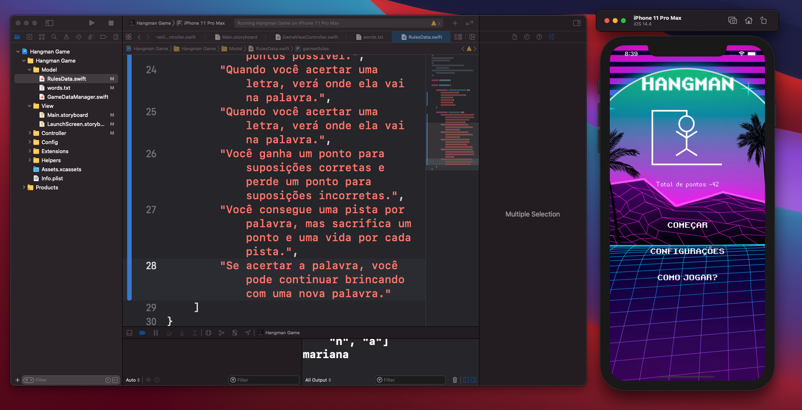

# Hangman Game | Forca.

**Hangman** desenvolvido para iOS usando Swift 5. O aplicativo é intuitivo e permite adivinhar palavras, cada vez que uma palavra é respondida incorretamente pontos são deduzidos e o Hangman é desenhado na tela.

O jogo Hangman usa o padrão de design MVC e carrega uma lista de palavras do pacote de aplicativos. O design e os efeitos sonoros são influenciados pelos clássicos do fliperama.

O aplicativo é atualizado ativamente para adotar os recursos mais recentes do iOS e da linguagem Swift.

## 📸 Screenshots

## 🙌 Por que este jogo Hangman é incrível?
* 🕹 **Retro arcade design**
* 🚀 **Subtle animations**
* 📲 **Clean architecture**

Em breve:
* 🤳🏾**Multiplayer**

## 🏃🏽‍♀️ Como começar
O guia a seguir o ajudará a começar e baixar o repo:
* [Cloning a repo](https://github.com/mrdouglasmorais/hangman-swift)

## Requerido
* Xcode 9
* iOS 10+
* Swift 4
